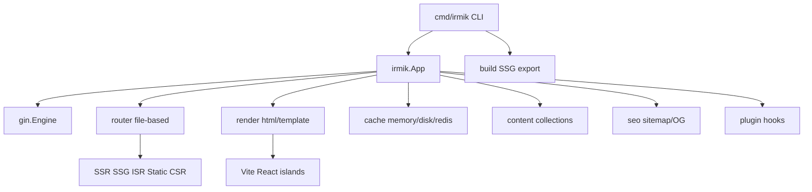

<p align="center">
  
</p>

<h1 align="center">Irmik</h1>

<p align="center">
  
  
</p>

**Irmik** is a Gin-based meta-framework for Go: **thin core**, **wide opt-in catalog**.  
Use it for **admin / internal systems** and **SSR sites** that need security defaults and speed — without dragging a CMS or a megakit into every binary.

You get file-based routing, route-level **SSR / SSG / ISR / Static / CSR**, `html/template` pages, React/Vite islands, Markdown content, auth, SQL/migrate, realtime, a small CLI, and platform helpers (upload, queue, mail, OpenAPI, …) that stay out of the link until you import them.

**Module:** [`github.com/boracomet/go-irmik`](https://github.com/boracomet/go-irmik)

> **Türkçe özet:** Irmik, Gin üzerine kurulu bir meta-framework’tür. Çekirdek ince kalır; upload, kuyruk, mail, OpenAPI gibi parçalar **isteğe bağlı** paketlerdir. Dosya tabanlı rotalar, SSR/SSG/ISR, `html/template` + React/Vite islands, Markdown içerik, auth/session, SQL/migration, SSE/WebSocket ve admin güvenlik varsayılanları sunar. Hem iç sistem / admin panelleri hem de SSR siteler için uygundur. Karşılaştırma: [docs/compare.md](docs/compare.md). Katalog: [docs/catalog.md](docs/catalog.md).

## Why Irmik

- **Gin-compatible** — keep Gin handlers, middleware, and ecosystem muscle memory
- **Thin core + lean linking** — Redis, DB drivers, S3, OTel, gRPC link only when blank-imported
- **Wide opt-in catalog** — platform pieces without a batteries-forced megakit ([docs/catalog.md](docs/catalog.md))
- **SSR / SSG / ISR** — per-route modes in `_meta.yaml`, seeded by `irmik build`
- **Admin security defaults** — baseline headers; `EnableSecureDefaults()` rate limit; CSRF for cookie sessions
- **Auth + SQL + realtime** — sessions/JWT/RBAC, `database/sql` + migrate, SSE + WebSocket hubs
- **First-class CLI** — `dev`, `build`, `generate`, `start`, `migrate`, `cache clear`
- **Islands when you need interactivity** — React/Vite without turning the whole app into SPA-only

## What each major piece does

| Piece | Role | Docs |
|-------|------|------|
| **Routing & modes** | `app/**/page.html` + `_meta.yaml` → Gin routes; SSR/SSG/ISR/Static/CSR | below |
| **Render** | Layouts, partials, `html/template` + `tmplfunc` helpers | — |
| **Content** | `content/<collection>/**/*.md` + frontmatter (goldmark) | — |
| **Islands** | `{{ island "Name" … }}` via Vite + React | — |
| **Auth** | Sessions, CSRF, JWT, passwords, RBAC, OAuth stubs | [auth](docs/auth.md) |
| **DB / migrate** | Opt-in drivers + golang-migrate–compatible files + optional GORM | [database](docs/database.md) |
| **Realtime** | SSE streams + WebSocket hub/rooms | [realtime](docs/realtime.md) |
| **Security** | Headers by default; rate limit / login limits for admin | [security](docs/security.md) |
| **Catalog** | upload, storage/S3, forms, mail, queue, scheduler, openapi, observe, compress, imagex, secrets, grpcx, proxy, testkit, audit | [catalog](docs/catalog.md) |
| **CLI** | generate routes, dev server, build/export, migrate | below |

## Comparison (scan)

| | **Irmik** | **Gin alone** | **[StatiGo](https://github.com/Elagoht/StatiGo)** | **Echo** | **Buffalo** | **Fiber** |
|---|-----------|---------------|--------------------------------------------------|----------|-------------|-----------|
| HTTP | Gin | Gin | chi | Echo | gorilla/mux | fasthttp |
| SSR/SSG/ISR | Yes | — | Yes (static-first) | — | Templates / pipeline | — |
| Auth/RBAC | Opt-in | DIY | Site security focus | DIY | Ecosystem | DIY |
| SQL/migrate | Opt-in | DIY | — | DIY | Pop/Soda | DIY |
| Realtime | SSE + WS | DIY | — | DIY | Workers | WS DIY |
| Admin security defaults | Yes | — | Strong site defaults | DIY | Conventions | DIY |
| Opt-in catalog | Wide | — | Site kit | MW ecosystem | Batteries (heavier) | MW ecosystem |
| Lean linking | Yes | Very lean | Lean / embed | Lean | Heavier | Lean-ish |
| Best fit | Admin + SSR sites | APIs / glue | Content/SEO sites | APIs | Full-stack apps | Fast APIs |

Full notes and fair caveats: **[docs/compare.md](docs/compare.md)**. StatiGo lessons (attribution): [docs/statigo-lessons.md](docs/statigo-lessons.md).

## Quick start

```bash
go get github.com/boracomet/go-irmik@latest

# try the example blog
cd examples/blog
npm install && npm run dev   # optional islands HMR on :5173
go run .                     # http://127.0.0.1:8080
```

Minimal app sketch:

```go
cfg, _ := config.Load("irmik.yaml")
app, _ := irmik.New(cfg)
_ = app.MountPages(irmik.MountOptions{
    Loaders: map[string]router.Loader{
        "/": irmik.AdaptLoader(func(c *irmik.Context) (any, error) {
            return map[string]any{"Title": "Home"}, nil
        }),
    },
})
_ = app.Run(ctx)
```

## Rendering modes

Set `mode` in `_meta.yaml` next to each `page.html`:

| Mode | Runtime | Build (`irmik build`) |
|------|---------|------------------------|
| `ssr` | Render every request | skipped |
| `ssg` | Serve `out/` (fallback live render) | pre-render HTML |
| `isr` | Cache HIT/STALE + background revalidate; `ETag` / `X-Cache` | seed HTML + cache |
| `static` | Prefer `out/` / `public/` | copy / pre-render |
| `csr` | Thin shell + islands | shell HTML |

```yaml
# app/blog/[slug]/_meta.yaml
mode: isr
revalidate: 60s
sitemap: true
```

## File-based routing

```text
app/
  layout.html
  page.html              → /
  _meta.yaml
  about/
    page.html            → /about
    _meta.yaml           # mode: ssg
  blog/
    page.html            → /blog
    [slug]/
      page.html          → /blog/:slug
      _meta.yaml         # mode: isr
```

Register data loaders by Gin path pattern (`/blog/:slug`) via `MountOptions.Loaders` or `Router.RegisterLoader`.

## Content collections

```go
store, _ := content.Load("content")
posts, _ := content.List[PostMeta](store, "posts")
doc, _ := content.Get[PostMeta](store, "posts", "hello-irmik")
```

`irmik build` expands dynamic routes from collections when possible (`/blog/:slug` ← `content/posts`).

## Islands

```html
<head>{{ islandRuntime }}</head>
<body>
  {{ island "Counter" (dict "initial" 0) }}
</body>
```

Dev: Vite at `islands.devServer`. Prod: `public/islands/manifest.json`. Scaffold: `templates/scaffold/`.

## CLI

```bash
go run ./cmd/irmik --help

irmik generate          # app/ → zz_routes_gen.go
irmik dev               # Gin + optional Vite + fsnotify
irmik build             # islands + SSG/ISR seed + sitemap → out/
irmik start             # production serve
irmik cache clear       # wipe configured cache store
irmik migrate up|down|status|create <name>
```

## Database

SQL via `database/sql` and golang-migrate–compatible files under `migrations/`. Drivers are **opt-in** blank-imports — see [docs/database.md](docs/database.md).

```go
import _ "github.com/boracomet/go-irmik/irmik/db/sqlite" // or postgres / mysql
```

```yaml
# irmik.yaml
database:
  driver: sqlite
  dsn: ./data/app.db
  migratePath: migrations
```

## Security

Baseline headers ship with `irmik.New`. Admin apps should also call `app.EnableSecureDefaults()` (rate limit) and use CSRF for cookie sessions. Details: [docs/security.md](docs/security.md).

## Lean linking (optional drivers)

Heavy optional backends are **not** linked until you import them:

| Need | Import |
|------|--------|
| Cache Redis | `_ "github.com/boracomet/go-irmik/irmik/cache/redisx"` |
| Session Redis | `_ "github.com/boracomet/go-irmik/irmik/session/redisx"` |
| SQLite | `_ "github.com/boracomet/go-irmik/irmik/db/sqlite"` |
| Postgres | `_ "github.com/boracomet/go-irmik/irmik/db/postgres"` |
| MySQL | `_ "github.com/boracomet/go-irmik/irmik/db/mysql"` |

## Opt-in catalog

Platform helpers live in separate packages — **not** wired by `irmik.New`. Import only what you need:

`upload`, `storage` (+ `storage/s3x`), `forms`, `mail`, `queue`, `scheduler`, `openapi`, `observe` (+ `observe/otelx`), `compress` (+ `brotlix`), `imagex`, `secrets`, `grpcx`, `proxy`, `testkit`, `audit`.

Full module map: **[docs/catalog.md](docs/catalog.md)**.

## Realtime

SSE and WebSocket helpers for Gin. Set `server.writeTimeout: 0` for long-lived connections. See [docs/realtime.md](docs/realtime.md).

```go
app.Engine.GET("/events", sse.Handler(sse.Options{Heartbeat: 15 * time.Second}, fn))
hub := ws.NewHub(ws.Options{AllowedOrigins: cfg.Realtime.AllowedOrigins})
hub.Start()
app.Engine.GET("/ws", hub.ServeHTTP)
```

## Architecture



See [docs/architecture.md](docs/architecture.md).

## Examples

- [`examples/blog`](examples/blog) — SSR home, SSG about, ISR posts, Counter island
- [`examples/auth`](examples/auth) — session login, CSRF, JWT, RBAC
- [`examples/realtime`](examples/realtime) — SSE clock/stream, WebSocket echo + chat room

## Status

| Area | Status | Docs |
|------|--------|------|
| Auth stack | Done | [docs/auth.md](docs/auth.md) |
| Database / migrations | Done | [docs/database.md](docs/database.md) |
| Realtime (SSE + WebSocket) | Done | [docs/realtime.md](docs/realtime.md) |
| Lean linking + security defaults | Done | [docs/security.md](docs/security.md) |
| Opt-in feature catalog | Done | [docs/catalog.md](docs/catalog.md) |

## What else (without overloading)

Low-cost, opt-in ideas (full cron/timezone, HTMX admin helpers, audit/CORS/logging presets, health dependency checks, `embed.FS`, i18n routing, OpenAPI codegen) — plus an explicit **do not add to core** list — live in **[docs/roadmap.md](docs/roadmap.md)**.

## License

MIT. StatiGo-inspired helpers are reimplementations; see [docs/statigo-lessons.md](docs/statigo-lessons.md) for attribution.
