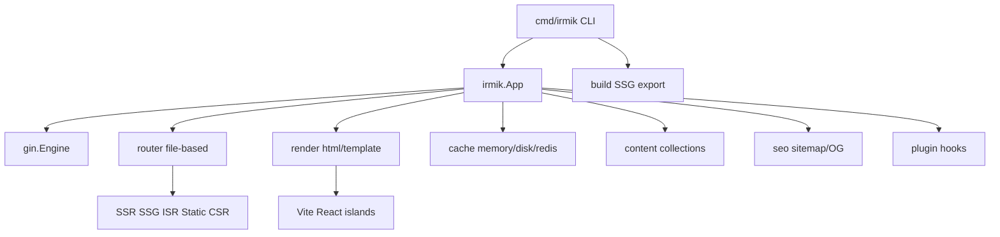

# Irmik

**Irmik** is a Next.js-inspired meta-framework for Go. It sits on [Gin](https://github.com/gin-gonic/gin) and gives you file-based routing, route-level rendering modes (SSR / SSG / ISR / Static / CSR), `html/template` pages, React/Vite islands, Markdown content collections, a small CLI, and an optional SQL data stack — without dragging in a full CMS.

> **Türkçe özet:** Irmik, Gin üzerine kurulu, dosya tabanlı rotalar ve SSR/SSG/ISR modları sunan bir meta-framework’tür. Sayfalar `html/template`, etkileşimli parçalar React/Vite islands, içerik Markdown koleksiyonlarıdır. Phase 2.1 auth/session; Phase 2.2 SQL/migration.

**Module:** [`github.com/boracomet/go-irmik`](https://github.com/boracomet/go-irmik)

## Features (Phase 1)

| Area | What you get |
|------|----------------|
| **HTTP** | Gin engine, recovery, request ID, `/health` + `/ready` |
| **Routing** | `app/**/page.html` + `_meta.yaml`; `[slug]` → `:slug` |
| **Modes** | SSR, SSG, ISR (TTL + stale revalidate), Static, CSR |
| **Templates** | Layouts, partials, `tmplfunc` helpers (`dict`, `slugify`, …) |
| **Islands** | `{{ island "Counter" … }}` via Vite + React |
| **Content** | `content/<collection>/**/*.md` + frontmatter (goldmark) |
| **SEO** | Title/OG/Twitter/JSON-LD helpers, `sitemap.xml`, `robots.txt` |
| **Cache** | Memory / disk / Redis; ISR keys; `irmik cache clear` |
| **Data** | `irmik/db` (pgx / sqlite / mysql) + `irmik/migrate` + optional GORM helper |
| **Auth** | Sessions, CSRF, JWT, passwords, RBAC, OAuth provider stubs ([docs/auth.md](docs/auth.md)) |
| **CLI** | `dev`, `build`, `generate`, `start`, `cache clear`, `migrate` |

## Quick start

```bash
go get github.com/boracomet/go-irmik@latest

# try the example blog
cd examples/blog
npm install && npm run dev   # optional islands HMR on :5173
go run .                     # http://127.0.0.1:8080
```

Minimal app sketch:

```go
cfg, _ := config.Load("irmik.yaml")
app, _ := irmik.New(cfg)
_ = app.MountPages(irmik.MountOptions{
    Loaders: map[string]router.Loader{
        "/": irmik.AdaptLoader(func(c *irmik.Context) (any, error) {
            return map[string]any{"Title": "Home"}, nil
        }),
    },
})
_ = app.Run(ctx)
```

## Rendering modes

Set `mode` in `_meta.yaml` next to each `page.html`:

| Mode | Runtime | Build (`irmik build`) |
|------|---------|------------------------|
| `ssr` | Render every request | skipped |
| `ssg` | Serve `out/` (fallback live render) | pre-render HTML |
| `isr` | Cache HIT/STALE + background revalidate; `ETag` / `X-Cache` | seed HTML + cache |
| `static` | Prefer `out/` / `public/` | copy / pre-render |
| `csr` | Thin shell + islands | shell HTML |

```yaml
# app/blog/[slug]/_meta.yaml
mode: isr
revalidate: 60s
sitemap: true
```

## File-based routing

```text
app/
  layout.html
  page.html              → /
  _meta.yaml
  about/
    page.html            → /about
    _meta.yaml           # mode: ssg
  blog/
    page.html            → /blog
    [slug]/
      page.html          → /blog/:slug
      _meta.yaml         # mode: isr
```

Register data loaders by Gin path pattern (`/blog/:slug`) via `MountOptions.Loaders` or `Router.RegisterLoader`.

## Content collections

```go
store, _ := content.Load("content")
posts, _ := content.List[PostMeta](store, "posts")
doc, _ := content.Get[PostMeta](store, "posts", "hello-irmik")
```

`irmik build` expands dynamic routes from collections when possible (`/blog/:slug` ← `content/posts`).

## Islands

```html
<head>{{ islandRuntime }}</head>
<body>
  {{ island "Counter" (dict "initial" 0) }}
</body>
```

Dev: Vite at `islands.devServer`. Prod: `public/islands/manifest.json`. Scaffold: `templates/scaffold/`.

## CLI

```bash
go run ./cmd/irmik --help

irmik generate          # app/ → zz_routes_gen.go
irmik dev               # Gin + optional Vite + fsnotify
irmik build             # islands + SSG/ISR seed + sitemap → out/
irmik start             # production serve
irmik cache clear       # wipe configured cache store
irmik migrate up|down|status|create <name>
```

## Database (Phase 2.2)

SQL via `database/sql` (postgres/pgx, sqlite/modernc, mysql) and golang-migrate–compatible files under `migrations/`. See [docs/database.md](docs/database.md).

```yaml
# irmik.yaml
database:
  driver: sqlite
  dsn: ./data/app.db
  migratePath: migrations
```

```bash
irmik migrate create add_users
irmik migrate up
irmik migrate status
```

## Architecture



See [docs/architecture.md](docs/architecture.md) and [docs/statigo-lessons.md](docs/statigo-lessons.md) (patterns inspired by [StatiGo](https://github.com/Elagoht/StatiGo), MIT).

## Example

Fully wired demos:

- [`examples/blog`](examples/blog) — SSR home, SSG about, ISR posts, Counter island
- [`examples/auth`](examples/auth) — session login, CSRF, JWT, RBAC

## Phase 2 status

| Area | Status | Docs |
|------|--------|------|
| **2.1 Auth stack** | Done | [docs/auth.md](docs/auth.md) |
| **2.2 Database / migrations** | Done | [docs/database.md](docs/database.md) |

## Roadmap (later)

Validation/forms UI helpers, queues, OpenAPI/gRPC, observability, image optimization, `embed.FS` single-binary sites, richer i18n routing.

## License

MIT (planned). StatiGo-inspired helpers are reimplementations; see `docs/statigo-lessons.md` for attribution.
