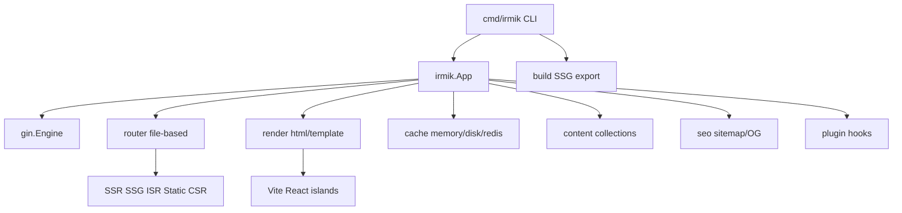

<p align="center">
  
</p>

# Irmik

**Irmik** is a Next.js-inspired meta-framework for Go. It sits on [Gin](https://github.com/gin-gonic/gin) and gives you file-based routing, route-level rendering modes (SSR / SSG / ISR / Static / CSR), `html/template` pages, React/Vite islands, Markdown content collections, a small CLI, and an optional SQL data stack — without dragging in a full CMS.

Brand mark lives at [`assets/irmik.png`](assets/irmik.png) (use for GitHub social preview if desired).

> **Türkçe özet:** Irmik, Gin üzerine kurulu, dosya tabanlı rotalar ve SSR/SSG/ISR modları sunan bir meta-framework’tür. Sayfalar `html/template`, etkileşimli parçalar React/Vite islands, içerik Markdown koleksiyonlarıdır. Phase 2.1 auth/session; Phase 2.2 SQL/migration; Phase 2.3 SSE/WebSocket.

**Module:** [`github.com/boracomet/go-irmik`](https://github.com/boracomet/go-irmik)

## Features (Phase 1)

| Area | What you get |
|------|----------------|
| **HTTP** | Gin engine, recovery, request ID, security headers, `/health` + `/ready` |
| **Routing** | `app/**/page.html` + `_meta.yaml`; `[slug]` → `:slug` |
| **Modes** | SSR, SSG, ISR (TTL + stale revalidate), Static, CSR |
| **Templates** | Layouts, partials, `tmplfunc` helpers (`dict`, `slugify`, …) |
| **Islands** | `{{ island "Counter" … }}` via Vite + React |
| **Content** | `content/<collection>/**/*.md` + frontmatter (goldmark) |
| **SEO** | Title/OG/Twitter/JSON-LD helpers, `sitemap.xml`, `robots.txt` |
| **Cache** | Memory / disk by default; Redis via `irmik/cache/redisx` |
| **Data** | `irmik/db` + opt-in drivers (`db/sqlite`, `db/postgres`, `db/mysql`) + migrate + optional GORM |
| **Auth** | Sessions, CSRF, JWT, passwords, RBAC, OAuth provider stubs ([docs/auth.md](docs/auth.md)) |
| **Security** | Headers by default; rate limit via `EnableSecureDefaults` ([docs/security.md](docs/security.md)) |
| **Realtime** | SSE (`irmik/sse`) + WebSocket hub/rooms (`irmik/ws`) ([docs/realtime.md](docs/realtime.md)) |
| **CLI** | `dev`, `build`, `generate`, `start`, `cache clear`, `migrate` |

## Quick start

```bash
go get github.com/boracomet/go-irmik@latest

# try the example blog
cd examples/blog
npm install && npm run dev   # optional islands HMR on :5173
go run .                     # http://127.0.0.1:8080
```

Minimal app sketch:

```go
cfg, _ := config.Load("irmik.yaml")
app, _ := irmik.New(cfg)
_ = app.MountPages(irmik.MountOptions{
    Loaders: map[string]router.Loader{
        "/": irmik.AdaptLoader(func(c *irmik.Context) (any, error) {
            return map[string]any{"Title": "Home"}, nil
        }),
    },
})
_ = app.Run(ctx)
```

## Rendering modes

Set `mode` in `_meta.yaml` next to each `page.html`:

| Mode | Runtime | Build (`irmik build`) |
|------|---------|------------------------|
| `ssr` | Render every request | skipped |
| `ssg` | Serve `out/` (fallback live render) | pre-render HTML |
| `isr` | Cache HIT/STALE + background revalidate; `ETag` / `X-Cache` | seed HTML + cache |
| `static` | Prefer `out/` / `public/` | copy / pre-render |
| `csr` | Thin shell + islands | shell HTML |

```yaml
# app/blog/[slug]/_meta.yaml
mode: isr
revalidate: 60s
sitemap: true
```

## File-based routing

```text
app/
  layout.html
  page.html              → /
  _meta.yaml
  about/
    page.html            → /about
    _meta.yaml           # mode: ssg
  blog/
    page.html            → /blog
    [slug]/
      page.html          → /blog/:slug
      _meta.yaml         # mode: isr
```

Register data loaders by Gin path pattern (`/blog/:slug`) via `MountOptions.Loaders` or `Router.RegisterLoader`.

## Content collections

```go
store, _ := content.Load("content")
posts, _ := content.List[PostMeta](store, "posts")
doc, _ := content.Get[PostMeta](store, "posts", "hello-irmik")
```

`irmik build` expands dynamic routes from collections when possible (`/blog/:slug` ← `content/posts`).

## Islands

```html
<head>{{ islandRuntime }}</head>
<body>
  {{ island "Counter" (dict "initial" 0) }}
</body>
```

Dev: Vite at `islands.devServer`. Prod: `public/islands/manifest.json`. Scaffold: `templates/scaffold/`.

## CLI

```bash
go run ./cmd/irmik --help

irmik generate          # app/ → zz_routes_gen.go
irmik dev               # Gin + optional Vite + fsnotify
irmik build             # islands + SSG/ISR seed + sitemap → out/
irmik start             # production serve
irmik cache clear       # wipe configured cache store
irmik migrate up|down|status|create <name>
```

## Database (Phase 2.2)

SQL via `database/sql` and golang-migrate–compatible files under `migrations/`. Drivers are **opt-in** blank-imports — see [docs/database.md](docs/database.md).

```go
import _ "github.com/boracomet/go-irmik/irmik/db/sqlite" // or postgres / mysql
```

```yaml
# irmik.yaml
database:
  driver: sqlite
  dsn: ./data/app.db
  migratePath: migrations
```

```bash
irmik migrate create add_users
irmik migrate up
irmik migrate status
```

## Security

Baseline headers ship with `irmik.New`. Admin apps should also call `app.EnableSecureDefaults()` (rate limit) and use CSRF for cookie sessions. Details: [docs/security.md](docs/security.md).

## Lean linking (optional drivers)

Heavy optional backends are **not** linked until you import them:

| Need | Import |
|------|--------|
| Cache Redis | `_ "github.com/boracomet/go-irmik/irmik/cache/redisx"` |
| Session Redis | `_ "github.com/boracomet/go-irmik/irmik/session/redisx"` |
| SQLite | `_ "github.com/boracomet/go-irmik/irmik/db/sqlite"` |
| Postgres | `_ "github.com/boracomet/go-irmik/irmik/db/postgres"` |
| MySQL | `_ "github.com/boracomet/go-irmik/irmik/db/mysql"` |

`cache.New` / `session.New` with `driver: redis` without the matching blank-import returns a clear error. Memory/disk cache and memory sessions need no extra import.

## Opt-in catalog (wide catalog, thin core)

Platform helpers live in separate packages — **not** wired by `irmik.New`. Import only what you need:

`upload`, `storage` (+ `storage/s3x`), `forms`, `mail`, `queue`, `scheduler`, `openapi`, `observe` (+ `observe/otelx`), `compress` (+ `brotlix`), `imagex`, `secrets`, `grpcx`, `proxy`, `testkit`, `audit`.

Full module map and “what gets linked”: **[docs/catalog.md](docs/catalog.md)**.

## Realtime (Phase 2.3)

SSE and WebSocket helpers for Gin. Set `server.writeTimeout: 0` for long-lived connections. See [docs/realtime.md](docs/realtime.md).

```go
app.Engine.GET("/events", sse.Handler(sse.Options{Heartbeat: 15 * time.Second}, fn))
hub := ws.NewHub(ws.Options{AllowedOrigins: cfg.Realtime.AllowedOrigins})
hub.Start()
app.Engine.GET("/ws", hub.ServeHTTP)
```

## Architecture



See [docs/architecture.md](docs/architecture.md) and [docs/statigo-lessons.md](docs/statigo-lessons.md) (patterns inspired by [StatiGo](https://github.com/Elagoht/StatiGo), MIT).

## Example

Fully wired demos:

- [`examples/blog`](examples/blog) — SSR home, SSG about, ISR posts, Counter island
- [`examples/auth`](examples/auth) — session login, CSRF, JWT, RBAC
- [`examples/realtime`](examples/realtime) — SSE clock/stream, WebSocket echo + chat room

## Phase 2 status

| Area | Status | Docs |
|------|--------|------|
| **2.1 Auth stack** | Done | [docs/auth.md](docs/auth.md) |
| **2.2 Database / migrations** | Done | [docs/database.md](docs/database.md) |
| **2.3 Realtime (SSE + WebSocket)** | Done | [docs/realtime.md](docs/realtime.md) |
| **Lean linking + security defaults** | Done | [docs/security.md](docs/security.md), lean linking above |
| **Opt-in feature catalog** | Done | [docs/catalog.md](docs/catalog.md) |

## Changelog notes

### Lean linking (breaking for Redis / multi-driver apps)

- `irmik/cache` and `irmik/session` no longer embed Redis. Blank-import `cache/redisx` / `session/redisx` (or call `Register()`).
- `irmik/db` no longer blank-imports mysql + pgx + sqlite together. Import `irmik/db/sqlite`, `postgres`, or `mysql` explicitly.
- Shims that would re-link Redis into core were **not** kept; use the packages above.

### Security defaults

- `irmik.New` always mounts baseline security headers (HSTS in production).
- `EnableSecureDefaults()` / `EnableRateLimit()` for in-memory rate limiting; `middleware.LoginRateLimit` for auth routes.

## Roadmap (later)

`embed.FS` single-binary sites, richer i18n routing, Redis/asynq queue backend, fuller OpenAPI/Swagger UI, WebP encode without CGO.

## License

MIT (planned). StatiGo-inspired helpers are reimplementations; see `docs/statigo-lessons.md` for attribution.
