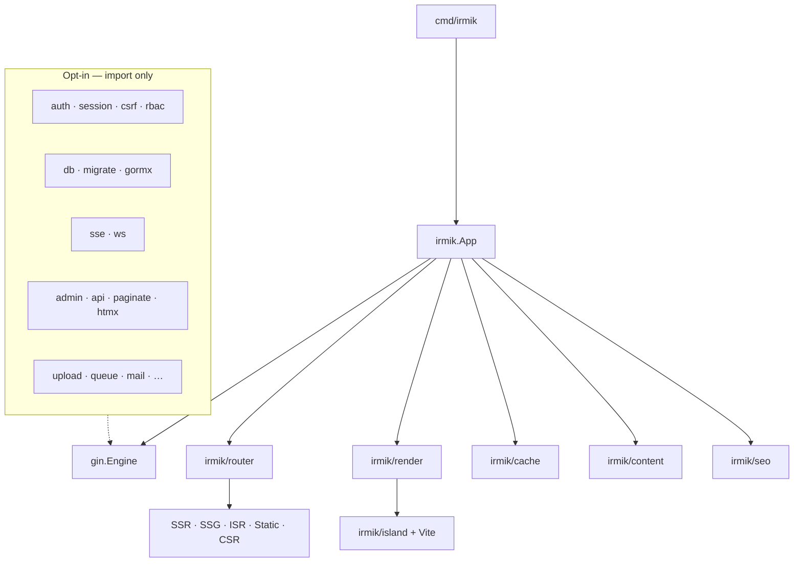

# Architecture

Irmik is a thin meta-framework around Gin. The public SDK lives under `irmik/`; CLI and build tooling under `cmd/` and `internal/`.

## Request path (SSR / ISR)

1. Gin matches a file-based route from `app/` discovery.
2. Optional **loader** returns view data (`MountOptions.Loaders`).
3. **render.Engine** executes `page.html` then wraps **layout.html** chain (root → leaf).
4. Template helpers: `tmplfunc` (`dict`, `slugify`, …) + **island** FuncMap (`island`, `islandRuntime`).
5. **ISR:** look up `cache.Key(method, path, locale)`; on HIT/STALE serve body with weak `ETag` and `X-Cache`; revalidate in background when stale; on MISS render and `Set`.
6. **Development only:** `devtools` injects the overlay script into HTML and serves `/_irmik/dev/*` (badge, errors, live reload).

## Build path (SSG / ISR seed)

1. Optional Vite `npm run build` for islands → `public/islands`.
2. Discover routes; skip pure SSR.
3. Expand dynamic segments via `Paths` or **content collections** (`ContentPaths`).
4. Write `out/**/index.html`, seed ISR cache entries.
5. Emit `sitemap.xml` + `robots.txt` through `irmik/seo`.

## Layer diagram

## Packages

### Core (used by a typical `irmik.New` app)

| Package | Role |
|---------|------|
| `irmik` | `App`, lifecycle, `AdaptLoader` |
| `irmik/router` | Discover + Gin handlers per mode |
| `irmik/render` | `html/template` engine |
| `irmik/island` | Vite manifest / dev URLs |
| `irmik/content` | Markdown + frontmatter |
| `irmik/seo` | Head tags, sitemap, robots |
| `irmik/cache` | memory / disk; Redis via `cache/redisx` |
| `irmik/middleware` | Recovery, request ID, health, secure headers, rate limit |
| `irmik/config` | `irmik.yaml` + env |
| `irmik/plugin` | before/after start/build/stop hooks |
| `irmik/tmplfunc`, `slug`, `fsutil`, `meta`, `lifecycle` | shared helpers |
| `internal/cli`, `internal/build`, `internal/hmr` | CLI plumbing |

### Major opt-in (not linked until imported)

| Package | Role | Docs |
|---------|------|------|
| `irmik/session`, `session/redisx`, `csrf` | Cookie sessions + CSRF | [auth.md](auth.md) |
| `irmik/auth`, `irmik/rbac`, `rbac/store` | Login/JWT/passwords/OAuth stubs + RBAC | [auth.md](auth.md), [rbac.md](rbac.md) |
| `irmik/db`, `db/sqlite\|postgres\|mysql`, `migrate`, `gormx` | SQL + migrations (+ optional GORM) | [database.md](database.md) |
| `irmik/sse`, `irmik/ws` | SSE + WebSocket hubs | [realtime.md](realtime.md) |
| `irmik/admin`, `api`, `paginate`, `htmx` | Admin UI + REST `/api/v1` | [admin.md](admin.md), [api.md](api.md) |
| `irmik/validate`, `forms`, `cors`, `audit`, `health`, … | Platform helpers | [catalog.md](catalog.md) |

Full module map: **[catalog.md](catalog.md)**.

## Config surface

Primary file: `irmik.yaml` (`app`, `server`, `cache`, `database`, `session`, `auth`, `build`, `content`, `seo`, `islands`, `i18n`, `realtime`). Env overrides: `IRMIK_ENV`, `IRMIK_BASE_URL`, `IRMIK_PORT`, `IRMIK_CACHE_DRIVER`, `REDIS_URL`, `DATABASE_URL`, `IRMIK_JWT_SECRET`, `IRMIK_SESSION_DRIVER`, …

## Non-goals (core)

Full i18n URL maps, minify-on-serve, a DI container, GraphQL-in-core, and a mandatory CMS/admin generator are out of scope for the thin core. Opt-in platform packages live beside the core — see [catalog.md](catalog.md) and [roadmap.md](roadmap.md).

Related: [auth.md](auth.md) · [rbac.md](rbac.md) · [database.md](database.md) · [realtime.md](realtime.md) · [admin.md](admin.md) · [api.md](api.md) · [security.md](security.md) · [devtools.md](devtools.md)
